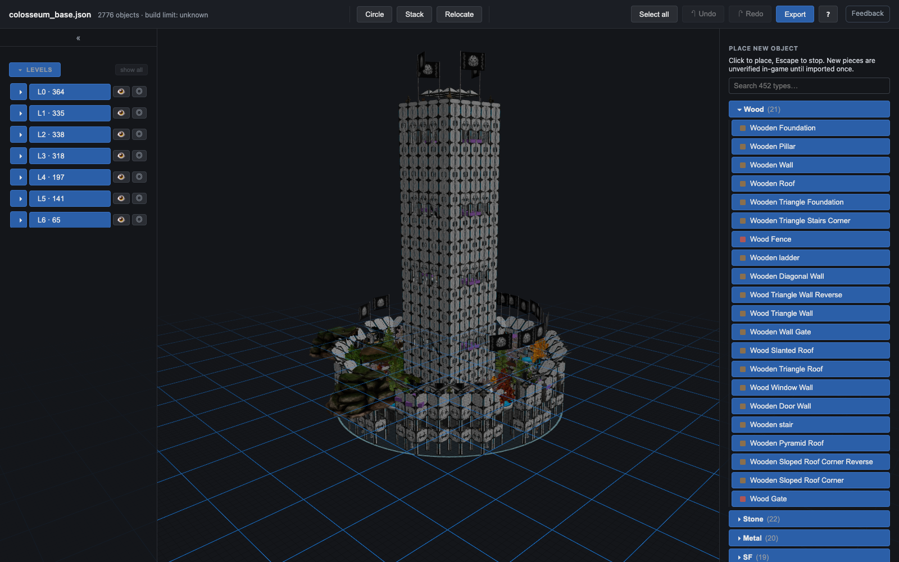
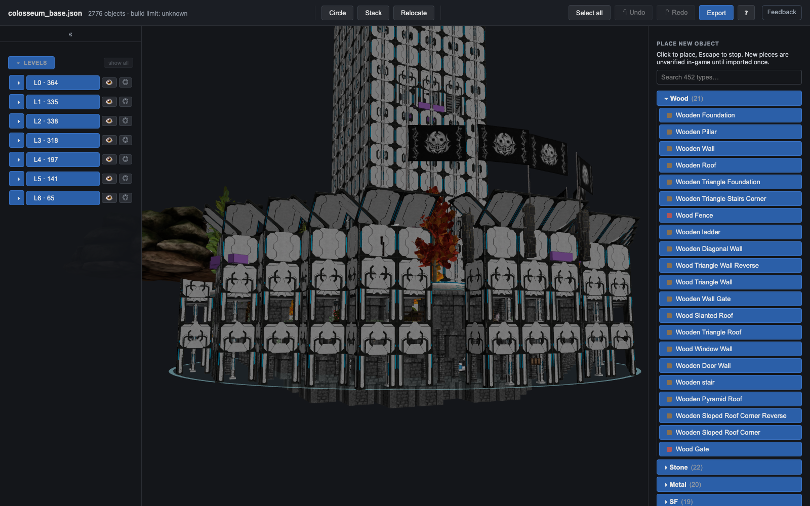
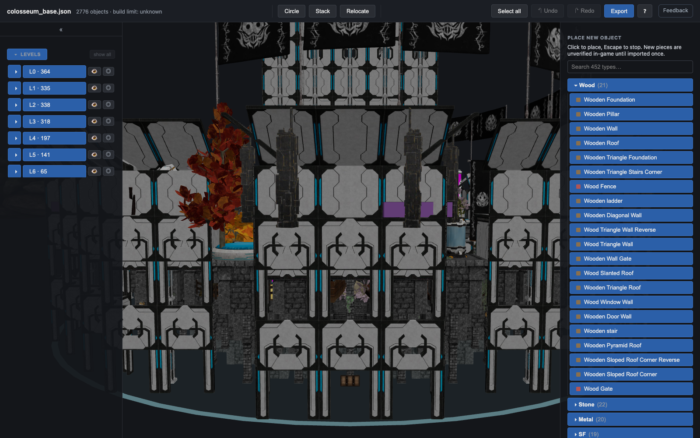
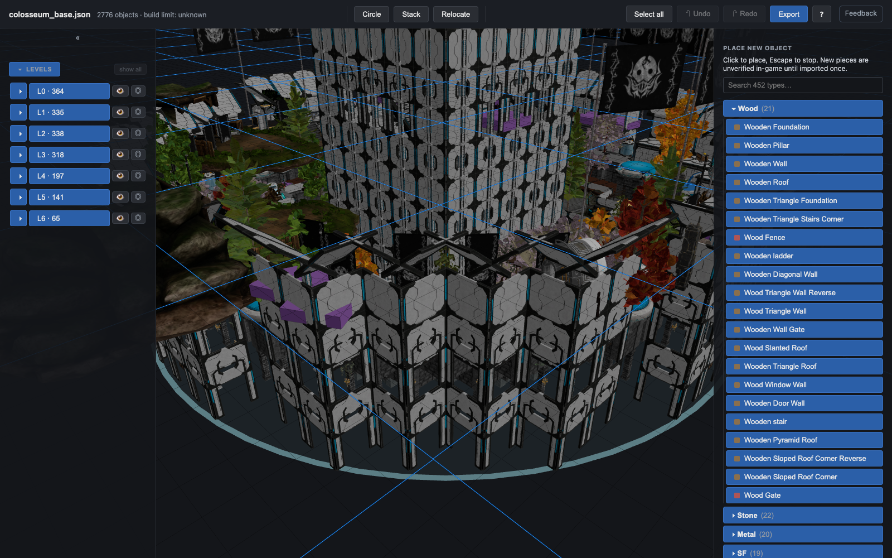
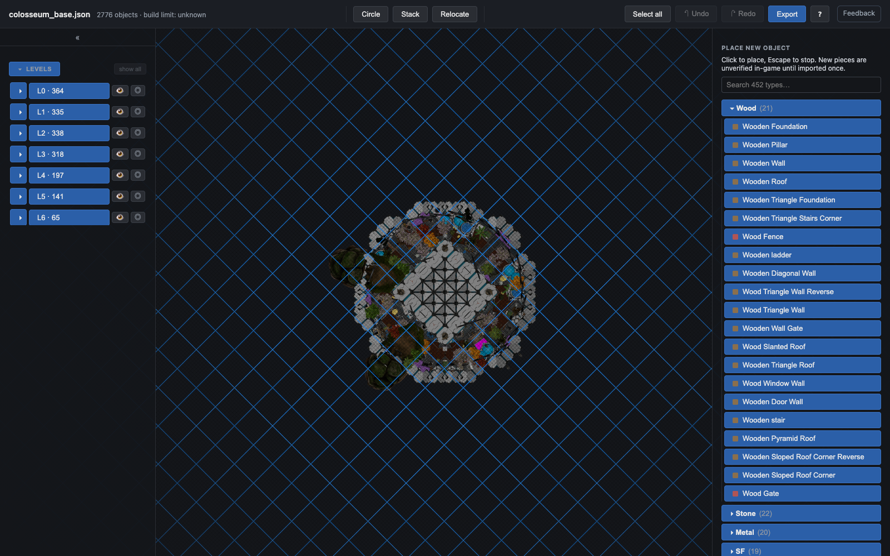
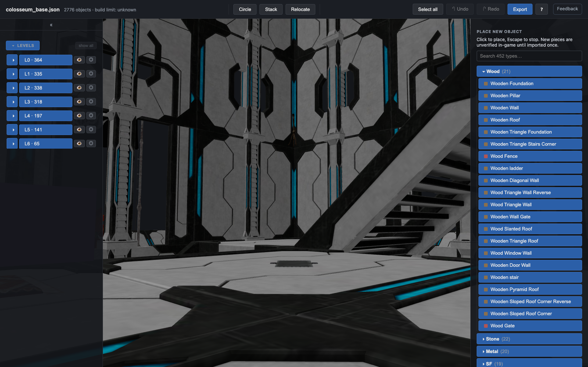
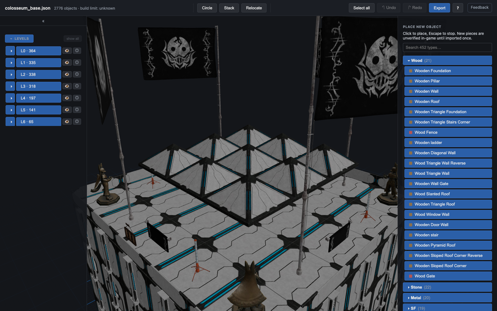

# Colosseum Maximus

A tiered amphitheatre with a 91 m spiral tower rising out of the arena, laid out
on Palworld's real build lattice and filled with a level‑80 endgame facility set.

**2,776 pieces · 182 distinct object types · 68.5 m across · 91.0 m tall (28 storeys)**



---

## What it is

| | |
|---|---|
| Pieces | 2,776 map objects (incl. the Palbox) |
| Distinct types | 182 |
| Footprint | 68.5 m diameter — max piece radius 3,423 cm inside the 3,500 cm `area_range` |
| Height | 9,100 cm = **91.0 m = 28 storeys** of the 325 cm vertical pitch |
| Base camp level | 23 |
| Materials | Ancient (tower, arcade, gallery) + Stone (arena sand, cavea, substructure) |

Elevation, from the ground up:

- **Arena floor (L0)** — a ring of stone foundations around the tower base. This
  is the works floor: three Ancient Blast Furnaces, four Ancient Workbenches,
  the Electric/Huge kitchens, the whole generator bank, and the ore nodes
  (Sky Island Ore Pit ×2, Stone/Coal/Copper/Quartz/Sulfur/Crystal pits, Oil Pump).
- **Cavea, three tiers (L1 / L2 / L3)** — concentric rings at radius 5, 6 and 7
  tiles, each stepping up 325 cm and carried on its own radial pillar
  substructure (228 stone pillars), exactly the way the real Colosseum carries
  its seating. Tier 1 is storage, tier 2 is farms and ranching, tier 3 is the
  dormitory/clinic/spa. Ancient fences rail every inward edge.
- **Vomitoria** — four radial stair runs on the cardinal axes climb
  arena → tier 1 → tier 2 → tier 3 → gallery, one storey per flight, so worker
  Pals can path to every level.
- **Outer façade (L0–L3) and top gallery (L4–L5)** — four superimposed arcade
  storeys of alternating Ancient Wall Gates (open arches) and Window Walls on
  Ancient pillars, carrying a gallery deck at L4, an attic storey, and a
  slanted-roof cornice at L5. Twelve turrets (machine gun / missile / bow gun)
  and the camp-management stations ring the gallery; banners and flags fly from
  the attic.
- **The tower (L0–L28)** — a 5×5 shell with a hollow 3×3 core. A spiral
  staircase runs the sixteen perimeter tiles: three stair tiles per side, a
  landing at each corner, twelve storeys per full loop. Twenty pillars per
  storey turn the shaft into a continuous colonnade; walls alternate solid and
  window, opening into Wall Gate loggias at the ground floor and at each deck.
  Interior decks at L6 / L12 / L18 / L24 (lounge, library, garden, shrine), a
  full 5×5 observation deck at L28, and a stepped pyramid finial above it.
- **The Palbox chamber** — the Palbox sits at the exact centre of the tower's
  ground floor, ringed by four Energy Storages and four chests. It has to be the
  centre: the base camp anchor follows the Palbox transform, and `area_range` is
  measured from there.

## Facilities (level‑80 endgame)

Benchmarked against the gallery's `venom8698_Ultimate_Level80_Base_04`
(845 pieces) and extended past it.

**Production (75 pieces, 41 types)** — Ancient Blast Furnace ×3, Blast Furnace 4 ×2,
Ancient Workbench ×4, Ancient Multi Product ×2, Ancient Cooking Stove ×2,
Electric Kitchen, Huge Kitchen, Cauldron, Factory Hard 04 ×2,
Weapon Factory Dirty 04 ×2, Sphere Factory Black 04 ×2, Factory Money,
Ancient Relic Recycler ×2, Dismantling Conveyor ×2, Crusher, Flour Mill,
Ice Crusher, Composite Desk, Repair Bench, Skill-Unlock Workbench, Lab,
Medicine Facility 03 ×2, Operating Table, Fishing Pond 1 + 2,
Station Deforest 3 ×2, Sky Island Ore Pit ×2, Stone/Coal/Copper/Quartz/Sulfur/
Crystal pits, Oil Pump 02, Ancient Spa ×2, Spa 3 ×2, plus the camp-management
set (Item Dispenser, Worker Extra Station, Work Hard 03, Work Speed Increase,
Sanity Decrease, Battle Director) and 16 work benches.

**Power** — Ancient Electric Generator ×2, Electric Generator Large ×2,
Transmission Tower, Energy Storage ×4.

**Breeding / ranching / farming** — Multi Electric Hatching Pal Egg With Breed ×3,
Monster Farm ×4, Ancient Farm Block ×3, all seven `FarmBlockV2` crops ×3 each,
Skill Fruit farm ×3.

**Pal care** — Ancient Clinic, Clinic, Ancient Medical Pal Bed ×10,
Medical Pal Bed 05 ×12, Pal Medicine Box, Pal Food Box, Cooler Pal Food Box,
Player Bed 03 ×4.

**Storage (32 pieces)** — Guild Chest, Global Pal Storage, Dimension Pal Storage,
Item Chest 04 ×18, Container ×2, Cooler Box, Tool Box.

**Utility** — Expedition ×2, Character Rank Up, Skin Change, Altar ×2,
Buildable Goddess Statue ×5.

**Defence** — 19 turrets (Defense Machinegun ×7, Defense Missile ×7,
Defense Bow Gun ×3, Defense Wait ×2) on the gallery and the tower decks,
plus 140 Ancient Fences as railings.

**Decor (402 pieces, 113 types)** — 52 torches climbing the tower corners,
36 wall torches on the spiral landings, 23 ceiling lamps, light poles, floor
lamps, candle sconces; all eight banner factions plus their flags on the attic
and the crown; 40+ furniture trees and bushes and 47 ivy on the tiers; four
Olympic Cauldrons on the sand; a furnished imperial box on tier 3 (rugs, sofas,
piano, globe, clock, fireplace, Jet Dragon and Ice Horse statues); themed tower
decks; signboards over each vomitorium.

## Screenshots

| | |
|---|---|
|  |  |
| Elevation — the four-storey arcade, cornice and attic banners | Façade detail — Wall Gate / Window Wall bays on Ancient piers |
|  |  |
| Into the bowl — three planted seating tiers | Plan — the circle approximated on the 400 cm lattice |
|  |  |
| Inside the tower — spiral stair and deck | The crown at 91 m |

## How it was built

`gen-colosseum.ts` computes every position on MapPal's verified lattice
(`docs/CALIBRATION.md`: 400 cm grid pitch, 325 cm vertical pitch, walls 200 cm
from their host foundation's centre, yaw-only quaternions) and then hands the
placement list to MapPal's own `reconcileExport()`. Every object is therefore a
verbatim donor bundle from a real PST export (`src/data/donors.json`) with fresh,
mutually consistent GUIDs — nothing about the file format is invented.

The skeleton is `fixtures/calibration_01.json`: its Palbox is kept and moved to
the arena centre, and all its other objects are dropped through
`reconcileExport`'s deletion path (which also removes their works and
containers). `base_camp_level` is set to 23, the value observed on a real
endgame camp.

Regenerate with:

```
npx tsx designs/colosseum-maximus/gen-colosseum.ts designs/colosseum-maximus/colosseum_base.json
```

Every `MapObjectId` used exists in `src/data/objects.json` (checked at
generation time — the generator throws on an unknown type or a missing donor).

### One fix applied on top of `writeback.ts`

25 donor types (`AncientWorkBench`, `AncientBlastFurnace`, `Ancient_Clinic`,
`SkinChange`, …) carry a `ConcreteModel` whose `RawData` PST could not decode —
an opaque `{values: {"~b": <base64>}}` blob with no `instance_id` field.
`writeback.ts` only remints `concrete_model_instance_id` when that decoded field
exists, so every clone of those types would ship the *donor's* concrete id: N
copies, one id. PST's importer maps ids old→new through a dict keyed by the old
id, so those copies would collapse onto a single mapping — the collision mode
that gutted a base in `docs/CALIBRATION.md`.

The generator therefore remints them itself. The blob layout was not guessed: it
was verified across five donors that bytes 0–15 are `concrete_model_instance_id`
and bytes 16–31 are the model `instance_id`, each GUID stored as four
little-endian uint32 groups. All three — blob, `Model` cross-ref, and the works
entry — are rewritten together. 382 non-zero concrete ids in the file, 382
unique.

## Importing it

1. Open **PalworldSaveTools** → **Map Viewer**.
2. Right-click the guild you want to own the base → **Import Base**.
3. Pick `colosseum_base.json`.
4. **Save in PST** with the game fully closed, or nothing reaches disk.

### Import caveats

- **PST imports a base as a NEW base camp, offset roughly 80 m** from its
  original coordinates (deliberate collision avoidance). It will not land where
  the source base was.
- **Same-world import requires PST ≥ 2.2.8.** Earlier versions identity-map
  instance ids, which collides the Palbox and lets the game delete the imported
  network on next load. Cross-world import is fine on any version.
- **The upstream `Connector.connect.any_place` remap defect is still unfixed**
  in PST (see `docs/CALIBRATION.md`). It does not affect this file — the
  generator emits objects with empty connector links, so there is nothing to
  cross-link.
- The build sits on a flat plane at the Palbox's Z. Real terrain at the
  destination will clip it; pick a flat spot, or move the whole base in MapPal
  after import.
- Two donor types (`DismantlingConveyor`, `DisplayCharacter`) reference an item
  container that was never harvested into the donor library, so PST may drop
  that one module. The objects themselves import normally. The same condition
  exists in the real exports these donors came from
  (`fixtures/sampler_02.json`).

## Notes on rendering

56 pieces across 24 types (`AncientWorkBench`, `BuildableGoddessStatue`,
`Bench_Wood`, `PalBoxV2`, …) have no measured gray-box dimensions in
`src/data/objects.json`, so MapPal draws them as magenta unknown boxes. That is
an editor registry gap, not a defect in the blueprint — the pieces are ordinary
game objects and spawn normally.

`validateLinkage` reports 2 warnings per opaque-`ConcreteModel` object
("`Model.concrete_model_instance_id` does not match its
`ConcreteModel.instance_id`"). This is a lint false positive on the
undecodable-blob shape: real PST exports trip it too (`fixtures/sampler_01.json`
produces 20 of them, `sampler_02.json` 24). After the remint described above the
underlying ids are genuinely unique and consistent.

## Height

28 storeys / 91.0 m matches the tallest structure in the verified dataset — the
Glass Tower (`public/union/union_07f13218.json`), which spans 91.3 m over 28.1
storeys. `docs/CALIBRATION.md` records that an imported ~47-storey tower spawned
intact, so imports are not the binding constraint; this design deliberately
stops at what a real base is known to reach.
